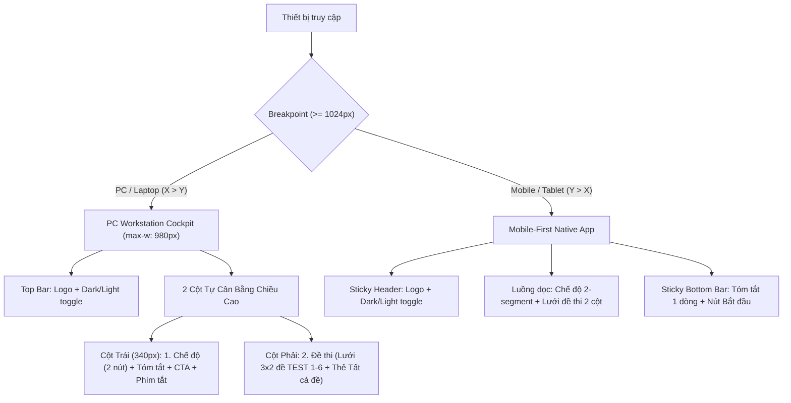

# Tài Liệu Kiến Trúc & Kinh Nghiệm Thực Chiến (Architecture & Lessons Learned)

> **Dự án**: tinAB - Ứng dụng Ôn Luyện & Thi Thử Trắc Nghiệm Tin Học  
> **Tài liệu tổng hợp**: Quá trình tái thiết kế WelcomeScreen, phân tách kiến trúc PC vs Mobile-First, giải quyết xung đột CSS, tối ưu mật độ thông tin và xây dựng bảng màu trung tính.

---

## 1. Bối Cảnh & Mục Tiêu

Dự án **tinAB** là ứng dụng luyện thi trắc nghiệm tin học hoạt động trên đa nền tảng (Web Desktop, Laptop, Tablet, Smartphone). Màn hình chào đón (`WelcomeScreen.tsx`) ban đầu gặp phải nhiều hạn chế:
1. **Giao diện mất cân bằng màu sắc**: Ban đầu lạm dụng màu đen kịt (`bg-slate-950`), gây mỏi mắt và không hỗ trợ chuyển đổi Light/Dark mode.
2. **Xung đột tầng CSS (Cascade Conflict)**: Sự pha trộn giữa Tailwind CSS v4, CSS unlayered toàn cục trong `app.css` và CSS Variables tự định nghĩa làm mất kiểu dáng trên trình duyệt.
3. **Chưa tối ưu tỉ lệ màn hình (X:Y)**: Màn hình PC (16:9 / 16:10) bị ép vào bố cục dạng cột hẹp của mobile, để lại khoảng trống vô nghĩa hai bên và buộc người dùng phải cuộn trang để thấy nút bấm.
4. **Nhiều thông tin mô tả thừa**: Các đoạn văn giải thích dài dòng làm loãng giao diện, tạo ra nhiều dead space.

**Mục tiêu giải quyết**:
- Thiết kế riêng biệt và tối ưu theo tỉ lệ màn hình: **PC Cockpit** cho Desktop/Laptop và **Mobile-First** cho điện thoại.
- Màu sắc trung tính cân bằng: *"Không tối, không sáng"*, dịu mắt, hỗ trợ Dark/Light mode mượt mà 100%.
- Tinh gọn mật độ thông tin: Loại bỏ mô tả rườm rà, loại bỏ triệt để các khoảng trống vô nghĩa.

---

## 2. Kiến Trúc Phân Tách: PC Cockpit (X > Y) vs Mobile-First (Y > X)

Tỉ lệ khung hình và cách tương tác trên máy tính và điện thoại hoàn toàn khác nhau:
- **PC / Laptop**: Chiều ngang X lớn hơn nhiều so với chiều dọc Y (16:9, 16:10), tương tác bằng chuột và bàn phím.
- **Mobile**: Chiều dọc Y lớn hơn nhiều so với chiều ngang X (9:19.5, 9:20), tương tác bằng ngón tay cái, màn hình cảm ứng.

### Đặc điểm thiết kế PC Cockpit
* **Container `max-w: 980px` đặt giữa màn hình**: Tránh việc kéo dãn vô độ ra hai biên màn hình 2K/4K.
* **Cân bằng chiều cao 2 cột tự nhiên**:
  * Cột trái (340px): Chọn chế độ làm bài (Luyện tập / Thi thử), tóm tắt lựa chọn, nút bắt đầu bài làm và danh sách phím tắt.
  * Cột phải: Lưới 6 bộ đề dạng 3x2 và thẻ tổng hợp toàn bộ 338 câu hỏi.
  * Cả hai cột đều cao xấp xỉ 270px, ăn khớp hoàn hảo, không sinh ra khoảng trống thừa.
* **Keyboard-First Navigation**: Người dùng máy tính có thể thao tác hoàn toàn bằng bàn phím mà không cần chuột:
  * Phím `1` đến `6`: Chọn trực tiếp TEST 1 đến TEST 6.
  * Phím `0` hoặc `A`: Chọn Tất cả các bộ đề.
  * Phím `M`: Chuyển đổi qua lại giữa Luyện tập và Thi thử.
  * Phím `Enter`: Bắt đầu làm bài ngay lập tức.

### Đặc điểm thiết kế Mobile-First
* **Chế độ làm bài dạng 2-Segment Tab**: Thay vì 2 thẻ lớn xếp dọc chiếm hết chiều cao màn hình, chế độ được nén thành 2 nút nhỏ nằm cạnh nhau: `[ 🎯 Luyện tập ] [ ⏱️ Thi thử ]`.
* **Lưới đề thi 2 cột**: Đảm bảo kích thước bấm ngón tay thuận tiện (tối thiểu 48px), có huy hiệu thông báo đề đang làm dở.
* **Thanh hành động đáy (Sticky Bottom Bar)**: Thu gọn thành 1 hàng ngang duy nhất (`TEST 1 • Luyện tập` bên trái và nút `Bắt đầu ➜` bên phải), luôn cố định ở khu vực ngón tay cái dễ chạm tới nhất mà không che khuất nội dung.

---

## 3. Các "Cạm Bẫy" Kỹ Thuật & Bài Học Đắt Giá

Trong quá trình refactor và xử lý xung đột CSS, các bài học quan trọng đã được đúc kết:

### ⚠️ Bài học 1: Cú pháp `@custom-variant` lạ làm sập toàn bộ CSS Pipeline
* **Hiện tượng**: Trình duyệt đột ngột mất 100% style, trang web biến thành văn bản thô trắng đen.
* **Nguyên nhân**: Dòng cú pháp thử nghiệm `@custom-variant dark (&:where(...));` được đặt ở đầu file `src/app.css`. Trong Tailwind CSS v4 và bộ phân tích cú pháp CSS của Vite, `@custom-variant` là at-rule không hợp lệ, khiến Vite ngừng biên dịch và không inject được CSS vào DOM.
* **Giải pháp**: Giữ chỉ thị chuẩn `@import "tailwindcss";` và kiểm soát giao diện bằng CSS Variables (`[data-theme="dark"]`) và class `.dark` chuẩn W3C.

### ⚠️ Bài học 2: Quy tắc Cascade Layer (Unlayered CSS vs Layered Utilities)
* **Bản chất kỹ thuật**: Trong CSS Cascade Layers Level 5:
  > **Các quy tắc CSS không nằm trong `@layer` (Unlayered CSS) LUÔN CÓ ĐỘ ƯU TIÊN CAO HƠN bất kỳ quy tắc nào nằm trong `@layer`, bất kể Specificity!**
* Tailwind v4 gói các utility trong `@layer utilities`. File `app.css` cũ có hơn 1,000 dòng unlayered CSS (như `body`, `*`, `.stage-card`). Khi đó, bất kỳ utility class nào của Tailwind bị trùng thuộc tính đều sẽ bị ghi đè hoàn toàn.
* **Giải pháp**: Xây dựng namespace class chuyên dụng (ví dụ `.welcome-...`) nằm trực tiếp trong `app.css` và dùng CSS Variables hệ thống. Cách tiếp cận này chấm dứt hoàn toàn xung đột specificity giữa Tailwind và CSS nội bộ.

### ⚠️ Bài học 3: Layout Shift do chênh lệch độ dày viền (`border` vs `border-2`)
* **Hiện tượng**: Khi click chọn đề thi hoặc chế độ, các thẻ xung quanh bị giật hoặc nhảy vị trí 1-2px.
* **Nguyên nhân**: Trạng thái bình thường dùng viền 1px (`border`), khi click kích hoạt lại đổi sang 2px (`border-2`). Việc thay đổi 1px viền làm thay đổi kích thước hộp (box model) thêm 2px chiều rộng và chiều cao.
* **Giải pháp**: Cố định độ dày viền (ví dụ `1.5px solid var(--border-subtle)`), khi active chỉ thay đổi `border-color` và `background-color`.

### ⚠️ Bài học 4: Lỗi cắt đỉnh trong Flexbox Centering (Centering Overflow Bug)
* **Hiện tượng**: Trên màn hình laptop nhỏ hoặc điện thoại, đỉnh trang (Logo, Header) bị đẩy khỏi mép trên của màn hình và thanh cuộn không thể kéo lên được.
* **Nguyên nhân**: Dùng `min-h-screen flex items-center justify-center`. Khi nội dung dài hơn chiều cao viewport, `justify-content: center` chia khoảng tràn đều ra cả trên và dưới. Vì trình duyệt không cho phép `scrollTop` âm, phần tràn lên phía trên bị biến mất hoàn toàn.
* **Giải pháp**: Dùng `flex-col justify-start` cho container bao ngoài và dùng `margin: auto` cho card con để tự căn giữa khi viewport đủ rộng mà không làm mất thanh cuộn.

### ⚠️ Bài học 5: Modal bị rò rỉ do State ngầm định trong `App.tsx`
* **Hiện tượng**: Vừa mở ứng dụng thì một lớp màn đen mờ (modal backdrop) phủ kín màn hình với form "Nhập tên người học" mà không thể đóng.
* **Nguyên nhân**: Trong `useSession.ts`, nếu `localStorage` chưa có tên người dùng thì `isNameModalOpen` tự kích hoạt `true`. Việc render `<NameModal isOpen={session.isNameModalOpen} />` bên trong nhánh `if (showWelcome)` làm modal tự động che khuất màn hình chào mừng.
* **Giải pháp**: Cách ly màn hình chào đón độc lập; chỉ render các modal và logic toàn cục khi người dùng đã bấm bắt đầu bài thi (`showWelcome = false`).

### ⚠️ Bài học 6: Wrapper SVG trong `icons.tsx` nuốt mất `className`
* **Hiện tượng**: Gán class Tailwind cho icon (như màu sắc, kích thước, hiệu ứng chuyển động) nhưng icon không thay đổi.
* **Nguyên nhân**: Component icon nhận prop `className?: string` trong interface nhưng thẻ `<svg>` bên trong lại quên không gán thuộc tính `className={className}`.
* **Giải pháp**: Kiểm tra và truyền đầy đủ `className={className}` vào mọi thẻ SVG trong thư viện icon.

---

## 4. Hệ Thống Màu Sắc Trung Tính ("Không Tối, Không Sáng")

Thay vì màu trắng lóa (`#ffffff`) hay đen tuyền (`#000000`), ứng dụng áp dụng bảng màu Neutral Slate dịu mắt:

| Token CSS | Chế độ Sáng (Light) | Chế độ Tối (Dark) | Vai trò sử dụng |
| :--- | :--- | :--- | :--- |
| `--bg-app` | `#f1f5f9` (Slate 100) | `#0f172a` (Slate 900) | Nền tổng thể, loại bỏ cảm giác chói lóa và đen kịt |
| `--bg-surface` | `#ffffff` (Pure White) | `#1e293b` (Slate 800) | Bề mặt thẻ chính, khối chứa nội dung |
| `--bg-subtle` | `#f8fafc` (Slate 50) | `#172133` (Charcoal) | Nền phụ, nút chọn ở trạng thái chưa kích hoạt |
| `--border-subtle` | `#e2e8f0` (Slate 200) | `#29384d` (Slate 750) | Đường viền ngăn cách tinh tế, rõ ràng |
| `--text-primary` | `#0f172a` (Slate 900) | `#f8fafc` (Slate 50) | Tiêu đề chính, văn bản cần độ tương phản cao |
| `--text-secondary`| `#475569` (Slate 600) | `#94a3b8` (Slate 400) | Văn bản phụ, số câu hỏi, trạng thái |
| `--accent-primary`| `#2563eb` (Blue 600) | `#3b82f6` (Blue 500) | Nút CTA chính, màu nhấn trạng thái active |

---

## 5. Checklist QA Frontend Cho Dự Án

Mỗi khi phát triển tính năng hoặc tối ưu giao diện mới, lập trình viên cần kiểm tra các tiêu chí:
1. [ ] **Biên dịch sạch**: Chạy `npm run build` kiểm tra Vite biên dịch không có cảnh báo hay lỗi cú pháp CSS.
2. [ ] **Không Layout Shift**: Nhấp chọn các thẻ/nút xem có hiện tượng nhảy vị trí do thay đổi viền hoặc đệm không.
3. [ ] **Kiểm tra độ cao Viewport**: Co chiều cao cửa sổ trình duyệt xuống dưới 600px để chắc chắn không bị cắt mất đỉnh trang.
4. [ ] **Kiểm tra Dark/Light Sync**: Nhấn đổi giao diện xem toàn bộ icon, viền, chữ và nền có chuyển màu mượt mà, đồng bộ không.
5. [ ] **Mật độ thông tin tối ưu**: Loại bỏ các đoạn văn mô tả thừa thãi không mang lại giá trị tương tác cho người dùng.
